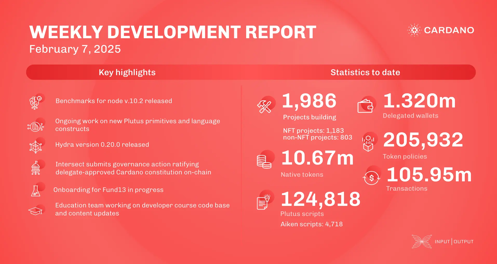

The February 7, 2025, development report covers node v.10.2 benchmarks, UTXO-HD improvements, and Genesis performance updates. The consensus team removed EBBs and fixed block replay issues. The Plutus team introduced "Plinth" (formerly Plutus Tx) and refined the script context API. Hydra v.0.20.0 enhanced memory usage, while Mithril prepared for the Pythagoras era at epoch 539. The Leios team reduced certificate sizes for better efficiency. These updates strengthen Cardano’s performance, smart contracts, and scalability.

 [**Read more**](https://www.essentialcardano.io/development-update/weekly-development-report-as-of-2025-02-07) 

 

