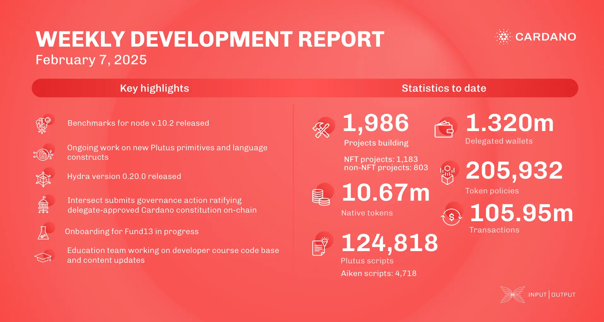

The network has benchmarked node v.10.2, alongside UTXO-HD and Genesis performance updates. The consensus team removed EBBs and fixed block replay issues, while the Plutus team rebranded Plutus Tx to Plinth and refined the script context API. Hydra v.0.20.0 improved memory usage, and Mithril prepared for the Pythagoras era at epoch 539. Additionally, the Leios team enhanced efficiency by reducing certificate sizes.

 [**Read more**](https://www.essentialcardano.io/development-update/weekly-development-report-as-of-2025-02-07) 

 

