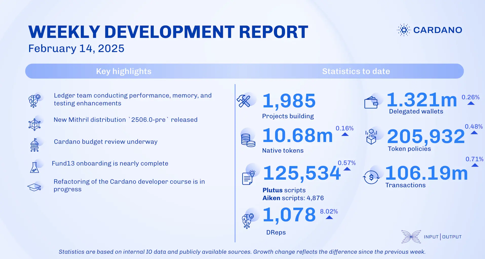

The February 14, 2025, development report highlights Cardano's ecosystem growth, with 1,985 projects building on the platform, 10.68 million native tokens issued, and 106.19 million transactions processed. The ledger team improved performance by optimizing Plutus script context computations and reducing memory usage. The Mithril team activated the 'Pythagoras' era on mainnet at epoch 539 and advanced incremental certification of the Cardano database. The Leios team focused on cryptography benchmarking and enhancing network modeling. Additionally, the interim constitutional council unanimously voted to replace the interim constitution with the Cardano constitution.

 [**Read more**](https://www.essentialcardano.io/development-update/weekly-development-report-as-of-2025-02-14) 

 

