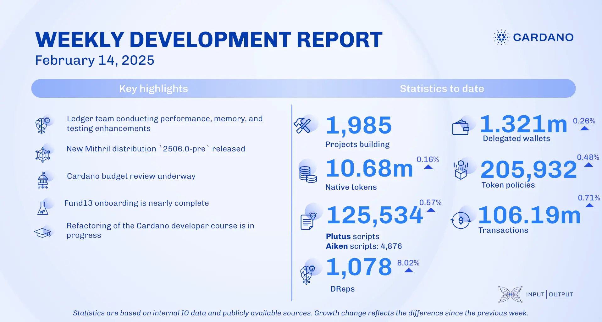

The ecosystem has reached 1,985 projects, 10.68 million native tokens, and 106.19 million transactions. The ledger team optimized Plutus script computations, reducing memory usage for better performance. Mithril activated the 'Pythagoras' era at epoch 539, advancing incremental database certification. Leios focused on cryptography benchmarking, while the interim council voted to officially adopt the Cardano Constitution.

 [**Read more**](https://www.essentialcardano.io/development-update/weekly-development-report-as-of-2025-02-14) 

 

