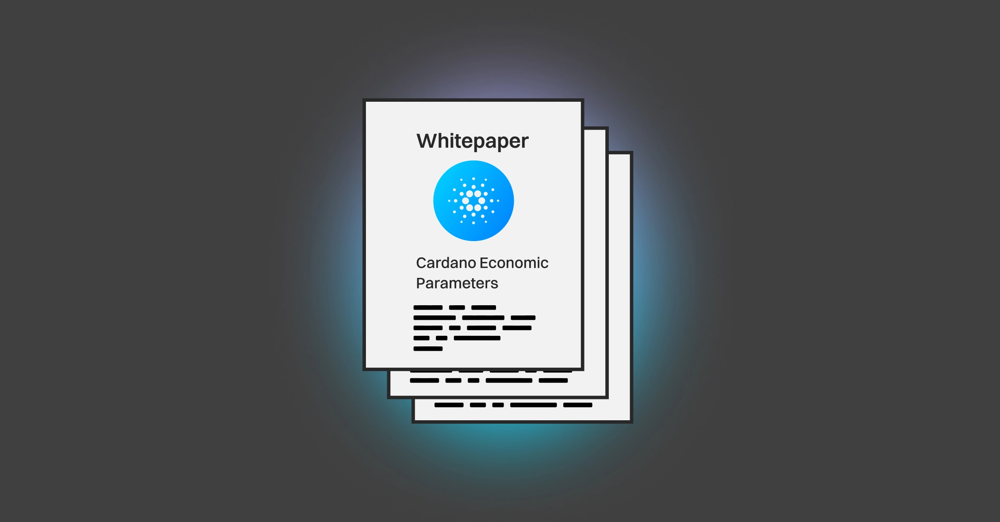

The Cardano Foundation released the "Cardano Economic Parameters" whitepaper by Professor Massimo Morini, analyzing how parameters like k (desired pool count) and a₀ (pledge influence) shape stake pool rewards. It explores the impact of pool size, pledge, and ecosystem reserves while clarifying reserve distribution between rewards and the treasury. The paper provides insights for stake pool operators and governance participants to support informed decision-making on Cardano’s long-term sustainability.

 [**Read more**](https://www.cardanofoundation.org/blog/deep-dive-cardano-economic-parameters) 

 

