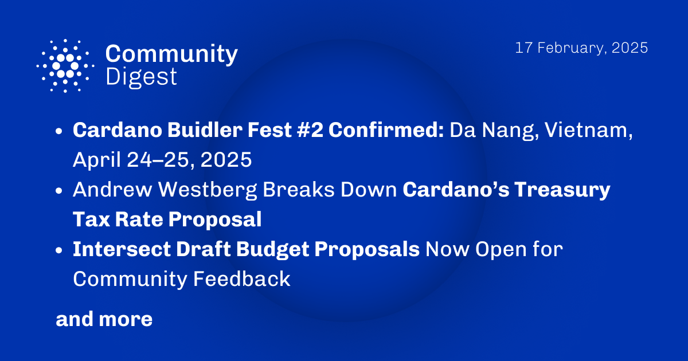

The February 17, 2025, Cardano Community Digest announces the upcoming "Cardano Buidler Fest #2" in Da Nang, Vietnam, on April 24–25, 2025. Andrew Westberg discusses a proposal to reduce the treasury tax rate from 20% to 10%, analyzing its potential effects on fund allocation and governance. Intersect MBO has released draft budget proposals for community feedback, covering topics like the Cardano Research Budget and Growth and Marketing strategies. Community members are encouraged to participate in discussions and provide input on these initiatives.

 [**Read more**](https://forum.cardano.org/t/digest-february-17-2025-cardano-buidler-fest-2-confirmed-da-nang-vietnam-april-24-25-2025-andrew-westberg-breaks-down-cardano-s-treasury-tax-rate-proposal-intersect-draft-budget-proposals-now-open-for-community-feedback/143251) 

 

