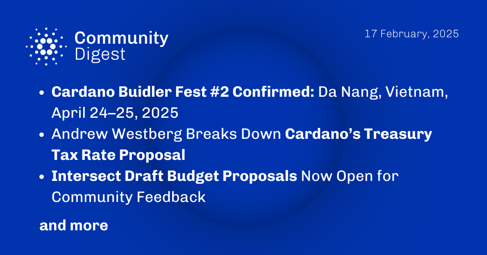

Cardano Buidler Fest #2 is scheduled for April 24–25, 2025, in Da Nang, Vietnam. A key proposal by Andrew Westberg suggests reducing the treasury tax rate from 20% to 10% to adjust fund allocation. Additionally, Intersect MBO has released draft budget proposals for feedback, covering Research and Growth and Marketing strategies to encourage community input.

 [**Read more**](https://forum.cardano.org/t/digest-february-17-2025-cardano-buidler-fest-2-confirmed-da-nang-vietnam-april-24-25-2025-andrew-westberg-breaks-down-cardano-s-treasury-tax-rate-proposal-intersect-draft-budget-proposals-now-open-for-community-feedback/143251) 

 

