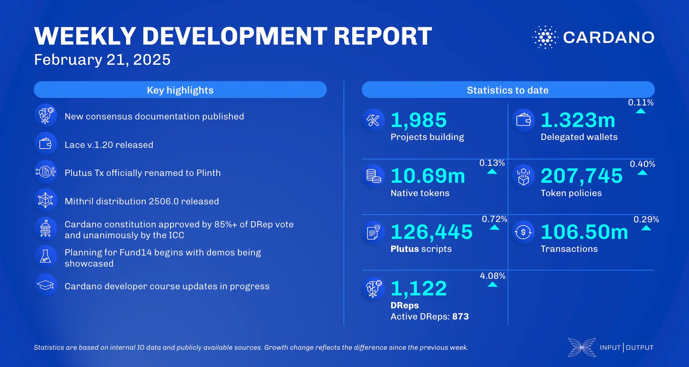

The February 21, 2025, development report highlights Cardano's stable growth, with 1,985 projects building on the platform and over 106.5 million transactions processed. The consensus team benchmarked the in-memory backend for UTXO-HD, achieving a 9% reduction in CPU usage. The Lace team released version 1.20.0, introducing wallet renaming and a new 'Governance' tab. The Plutus team rebranded Plutus Tx to Plinth, enhancing the compiler for improved smart contract development. Additionally, the Hydra team launched the Hydra explorer for better network monitoring.

 [**Read more**](https://www.essentialcardano.io/development-update/weekly-development-report-as-of-2025-02-21) 

 

