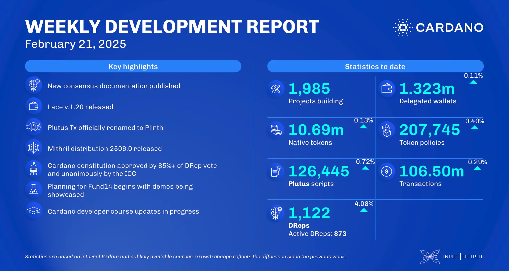

The network has reached 1,985 projects and 106.5 million transactions. The consensus team achieved a 9% CPU reduction benchmarking the UTXO-HD in-memory backend. Lace 1.20.0 launched with a new Governance tab, while Plutus Tx was rebranded to Plinth to improve smart contract development. Additionally, a Hydra explorer was released for enhanced network monitoring.

 [**Read more**](https://www.essentialcardano.io/development-update/weekly-development-report-as-of-2025-02-21) 

 

