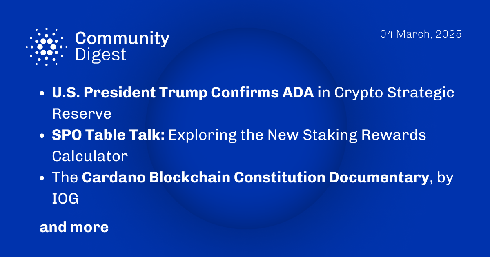

The March 4, 2025, Cardano Community Digest highlights the inclusion of ada in the newly announced U.S. Crypto Strategic Reserve alongside BTC, ETH, XRP, and SOL, reinforcing Cardano’s growing recognition. The latest SPO Table Talk explores the redesigned staking rewards calculator, featuring real-time data, Monte Carlo simulations, and governance modeling. IOG released a documentary on the Cardano Blockchain Constitution, capturing key moments from the December 2024 Constitutional Convention and its on-chain ratification in February 2025. These developments underscore Cardano’s increasing role in global finance, governance, and blockchain innovation.

 [**Read more**](https://forum.cardano.org/t/digest-march-04-2025-u-s-president-trump-confirms-ada-in-crypto-strategic-reserve-spo-table-talk-exploring-the-new-staking-rewards-calculator-the-cardano-blockchain-constitution-documentary-by-iog/) 

 

