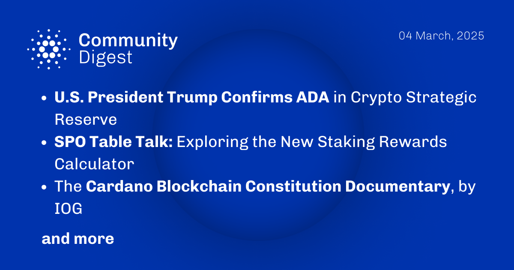

ADA is now part of the U.S. Crypto Strategic Reserve alongside BTC and ETH. A new staking rewards calculator has been released, featuring Monte Carlo simulations and real-time data. Additionally, a documentary covers the Cardano Constitution, from the 2024 convention to its on-chain ratification in February 2025.

 [**Read more**](https://forum.cardano.org/t/digest-march-04-2025-u-s-president-trump-confirms-ada-in-crypto-strategic-reserve-spo-table-talk-exploring-the-new-staking-rewards-calculator-the-cardano-blockchain-constitution-documentary-by-iog/) 

 

