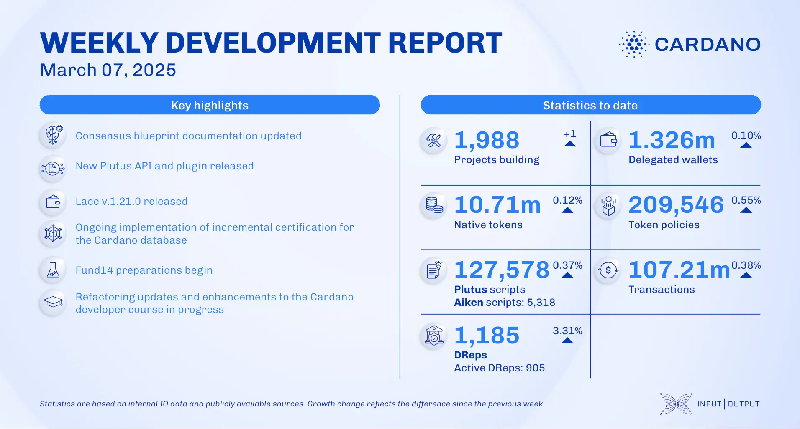

The March 7, 2025, development report highlights 1,988 projects on Cardano, 1.326 million delegated wallets, and 10.71 million native tokens. Smart contracts grew to 127,578 Plutus scripts, with 107.21 million on-chain transactions. Governance expanded to 1,185 DReps, including 905 active. Updates include Begin wallet’s DRep delegation, USDM’s beta launch, Emurgo’s DRep registration, Intersect’s roadmap proposal, the Cardano Foundation running nodes for Oraclecharli3 and Orcfax, and a five-week builder residency in Silicon Valley with Draper University.

 [**Read more**](https://www.essentialcardano.io/development-update/weekly-development-report-as-of-2025-03-07) 

 

