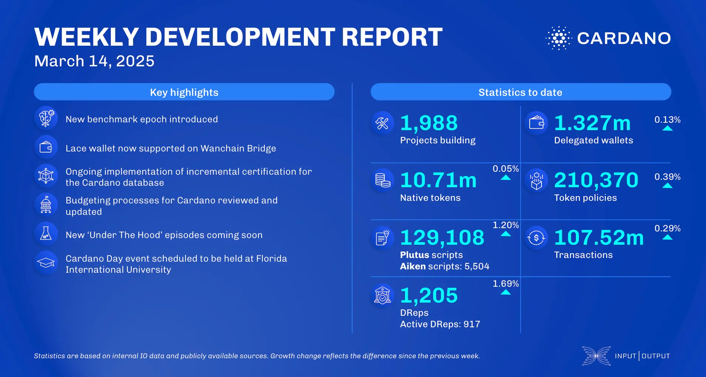

The March 14, 2025, development report highlights 1.327 million delegated wallets, 10.71 million native tokens, and 129,108 Plutus scripts. On-chain transactions reached 107.52 million, with governance engagement growing to 1,205 DReps. The Hoskinson Family Office invested $1.5 million in W3i Software, Cardano won Blockchain Project of the Year at Crypto Expo EU, and Sebastien Guillemot introduced Starstream, a zkVM for UTXO smart contracts. Lace integrated with Wanchain Bridge, and Mithril advanced aggregator prototypes. The performance team enhanced benchmarking, while the ledger team focused on serialization improvements.

 [**Read more**](https://www.essentialcardano.io/development-update/weekly-development-report-as-of-2025-03-14) 

 

