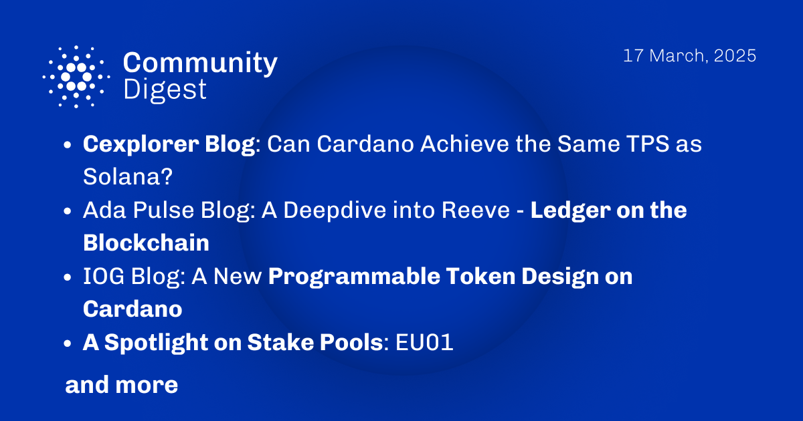

The March 17, 2025, *Cardano Community Digest* explores whether Cardano can match Solana’s TPS, with insights from Cexplorer. ADA Pulse examines Reeve, a ledger system leveraging blockchain for transparency. IOG introduces a new programmable token design, enhancing Cardano’s smart contract capabilities. The digest also spotlights EU01, a stake pool supporting decentralization. These discussions highlight Cardano’s continued innovation and expanding ecosystem.

 [**Read more**](https://forum.cardano.org/t/digest-march-17-2025-cexplorer-blog-can-cardano-achieve-the-same-tps-as-solana-ada-pulse-blog-a-deepdive-into-reeve-ledger-on-the-blockchain-iog-blog-a-new-programmable-token-design-on-cardano-a-spotlight-on-stake-pools-eu01/144381) 

 

