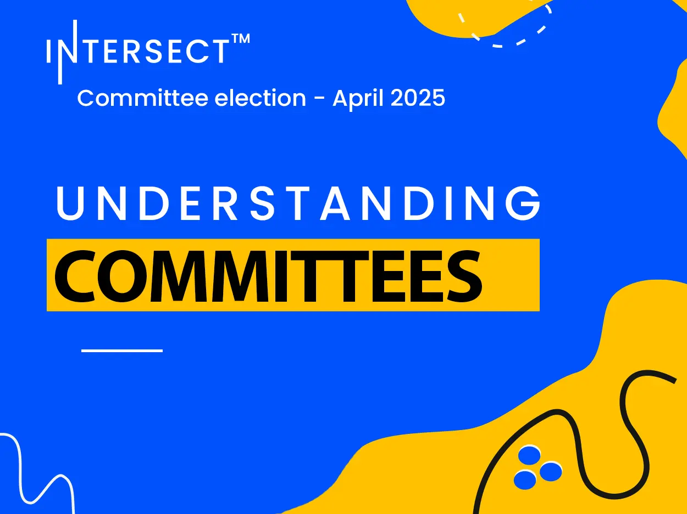

Intersect MBO supports Cardano’s growth through seven specialized committees elected biannually, providing governance guidance to DReps and SPOs. Committees include Steering, Budget, Civics, Growth and Marketing, Membership and Community, Open Source, and Product, each with unique roles like budget oversight, promoting decentralization, enhancing community engagement, and supporting open-source development. This structured approach ensures informed decision-making and strategic development within the ecosystem. Intersect’s model emphasizes transparency, accountability, and collaboration, promoting Cardano’s evolution as a community-driven network. Discover how these committees shape Cardano’s governance and contribute to its decentralized future. Read more for detailed insights.

 [**Read more**](https://www.intersectmbo.org/news/understanding-committees-in-intersect) 

 

