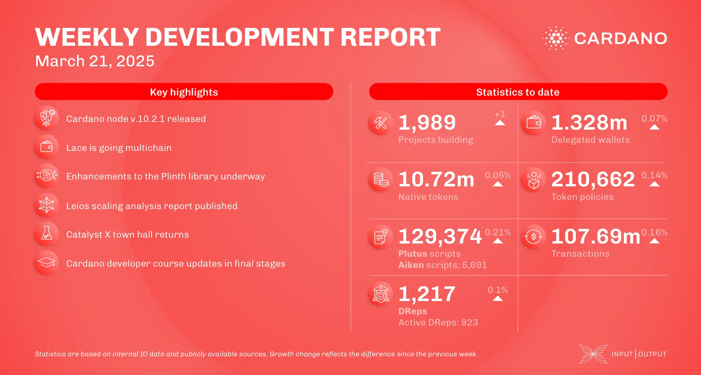

The March 21, 2025, development report highlights Cardano’s growth with 1.328 million delegated wallets, 10.72 million native tokens, and 130,507 Plutus scripts. On-chain transactions reached 107.98 million. Governance participation expanded to 1,215 DReps. Notable updates include new Ouroboros Genesis simulations, Lace's integration with USDM for payments, and Mithril’s progress on aggregator resilience. The Hydra team released version 0.21.0, focusing on improved data handling. Cardano Foundation's Venture Hub welcomed new members, including Yolo Finance and Metaverse Labs.

 [**Read more**](https://www.essentialcardano.io/development-update/weekly-development-report-as-of-2025-03-21) 

 

