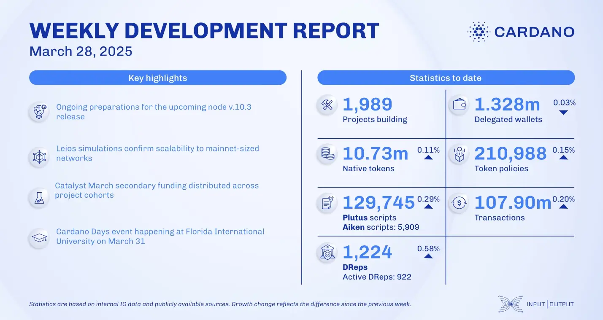

The March 28, 2025, development report highlights Cardano’s growth with 1.329 million delegated wallets, 10.73 million native tokens, and 131,200 Plutus scripts. On-chain transactions reached 108.35 million. Governance participation includes 1,220 DReps. Notable updates include Lace's release of version 1.21.0, Hydra's advancements in multi-party state channels, and Mithril's work on enhanced aggregator decentralization. The Cardano Foundation continues expanding its Venture Hub, onboarding projects like BlockSmith Labs and GreenChain.

 [**Read more**](https://www.essentialcardano.io/development-update/weekly-development-report-as-of-2025-03-28) 

 

