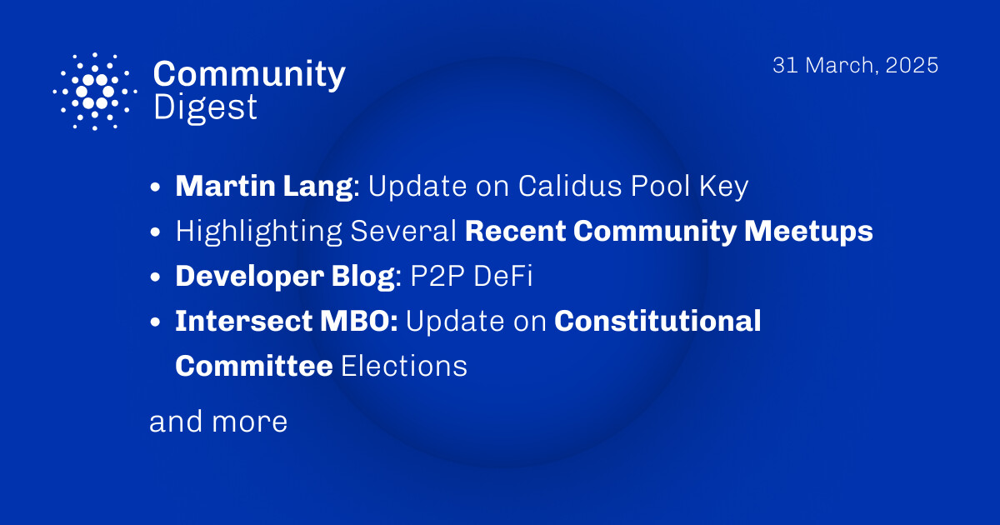

​The March 31, 2025, Cardano Community Digest features Martin Lang's update on the Calidus Pool Key, introducing a streamlined approach for pool-key management, now fully supported by Typhon Wallet, with more integrations forthcoming. The digest also recaps recent global Cardano meetups in Ghana, Brisbane, Vietnam, and a Korea-Japan collaboration, highlighting the community's active engagement worldwide. Additionally, it discusses Cexplorer's latest blog on the importance of scalability for Cardano's future and EMURGO's deep dive into decentralized blockchain governance. These developments underscore Cardano's ongoing innovation and the vibrant participation of its global community. 

 [**Read more**](https://forum.cardano.org/t/digest-march-31-2025-martin-lang-update-on-calidus-pool-key-highlighting-recent-community-meetups-developer-blog-p2p-defi-intersect-mbo-update-on-constitutional-committee-elections/144761) 

 

