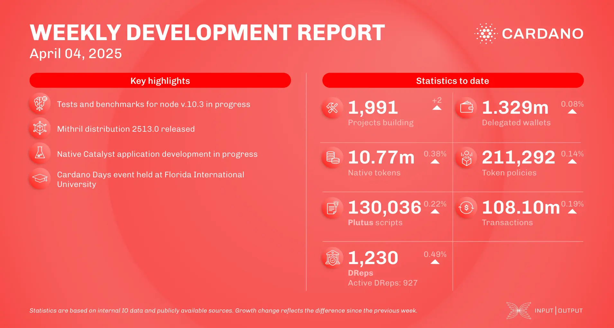

The April 4, 2025, development report highlights Cardano’s continued growth, with 1,991 projects building on the network, 1.329 million delegated wallets, and 10.77 million native tokens issued. Smart contracts reached 130,036 Plutus scripts, and on-chain transactions totaled 108.10 million. Governance engagement expanded to 1,230 DReps, including 927 active. Notable updates include Input Output's participation in Paris Blockchain Week, Turn Protocol's public testnet launch for privacy DeFi, LCX's submission of the first MiCA-compliant white paper for Cardano, and the upcoming release of Cexplorer 2.0 with a new backend and refreshed design.

 [**Read more**](https://www.essentialcardano.io/development-update/weekly-development-report-as-of-2025-04-04) 

 

