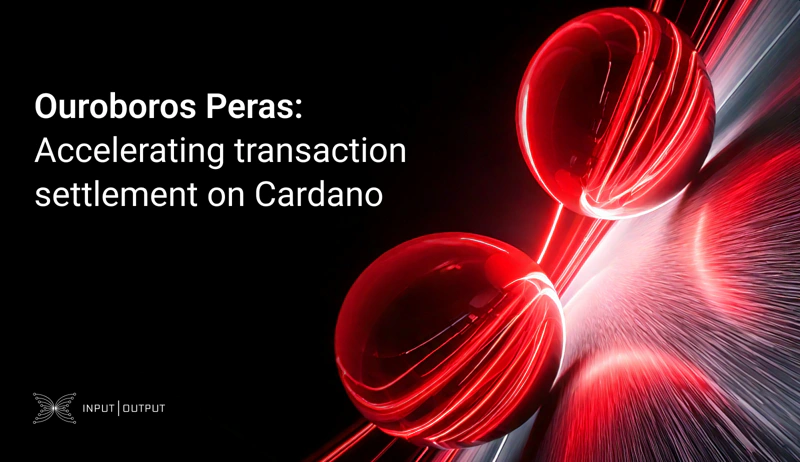

The April 11, 2025, blog post from IOG introduces Ouroboros Peras, an upgrade to the Ouroboros Praos protocol aimed at accelerating transaction settlement on Cardano. Peras reduces settlement times to around two minutes, increasing confidence in transaction finality. It introduces a voting-based chain selection process and certificate system to reach rapid consensus while maintaining security and decentralization. This advancement supports Cardano’s scalability and responsiveness to network demands.

 [**Read more**](https://iohk.io/en/blog/posts/2025/04/11/ouroboros-peras-accelerating-transaction-settlement-on-cardano/) 

 

