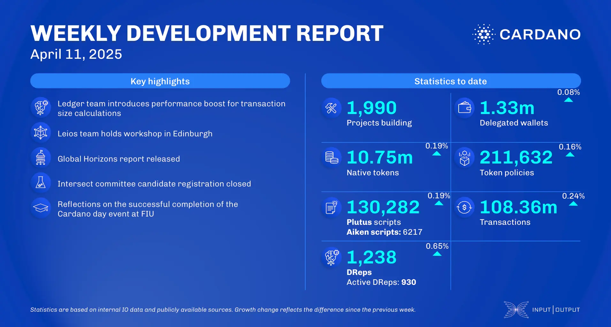

The April 11, 2025, development report highlights Cardano’s steady growth with 1,990 projects, 1.33 million delegated wallets, and 10.75 million native tokens. Smart contracts reached 130,282 Plutus and 6,217 Aiken scripts, with 108.36 million total transactions. Governance participation expanded to 1,238 DReps. Highlights include Charles Hoskinson’s keynote at Paris Blockchain Week, a node diversity workshop, and Draper University selecting 20 builders for its residency. Zekret Protocol will build on Cardano, and Eternl wallet launched a new version with UI upgrades and multi-sig support.

 [**Read more**](https://www.essentialcardano.io/development-update/weekly-development-report-as-of-2025-04-11) 

 

