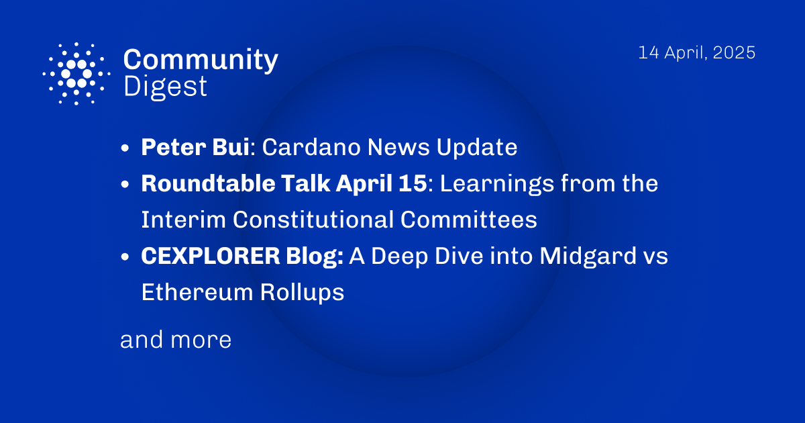

The April 14, 2025, Cardano Community Digest highlights Peter Bui’s latest Cardano News Update, addressing staking wallet issues and Iagon’s new decentralized compute and storage integrations. It previews Roundtable Talk #11 on April 15, where representatives from various councils will discuss experiences and lessons from the Interim Constitutional Committees. The Cexplorer blog offers a deep dive into Midgard versus Ethereum Rollups, emphasizing Midgard’s UTxO model for scalability and conflict resolution. Additionally, Intersect MBO announces that voting for the Constitutional Committee elections will commence on April 16.

 [**Read more**](https://forum.cardano.org/t/digest-april-14-2025-peter-bui-cardano-news-update-roundtable-talk-april-15-learnings-from-the-interim-constitutional-committees-cexplorer-blog-a-deep-dive-into-midgard-vs-ethereum-rollups/145195) 

 

