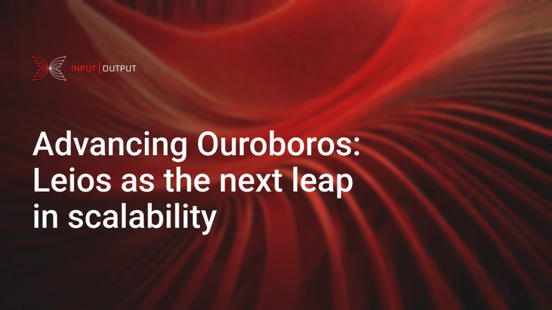

Input Output Global (IOG) published an update on Ouroboros Leios, presented as a major redesign of Cardano's consensus protocol aimed at significantly increasing transaction throughput and scalability. The post explains how Leios utilizes a novel concurrent structure with specialized block types (input, endorsement, ranking) to enable parallel processing while preserving the security and decentralization of Ouroboros Praos. Currently in the research and development phase, Leios is positioned as a transformative upgrade for Cardano's long-term capacity.

 [**Read more**](https://iohk.io/en/blog/posts/2025/04/17/advancing-ouroboros-leios-as-the-next-leap-in-scalability/) 

 

