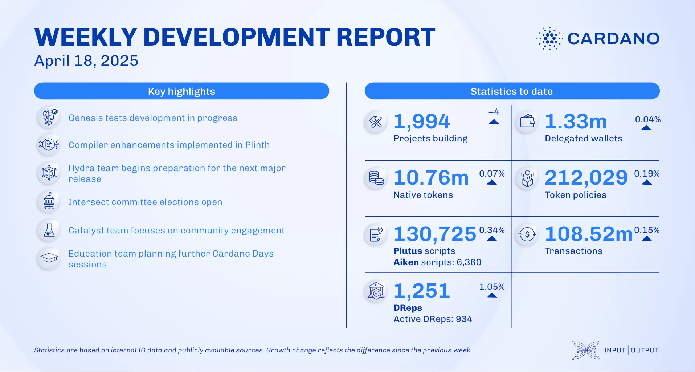

The April 18, 2025, development report highlights core technology advancements, including consensus team progress on Genesis testing and collaboration with the Ouroboros Phalanx team. Networking focused on transaction submission features, while performance benchmarked node v.10.3.1. The Plutus team delivered several improvements to Plinth, enhancing the smart contract compiler and libraries. Work also continued across scaling solutions, wallet development, and governance features.

 [**Read more**](https://www.essentialcardano.io/development-update/weekly-development-report-as-of-2025-04-18) 

 

