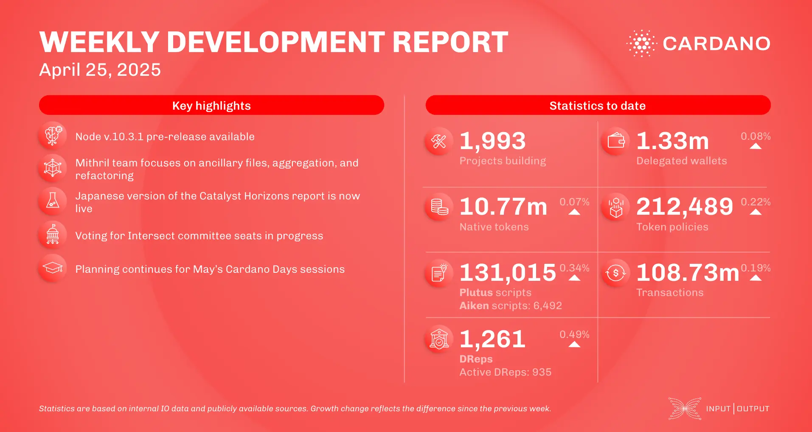

The April 25, 2025, development report highlights core technology updates, including ledger team work preparing for future eras and the pre-release of node v.10.3.1 focusing on performance improvements and lightweight checkpointing support. Ecosystem growth continued, and key updates include DRep delegation going live on Yoroi Wallet, Kinka minting its first XNK tokens on Cardano, a new EMURGO partnership announcement, and the launch of ChadSwap.

 [**Read more**](https://www.essentialcardano.io/development-update/weekly-development-report-as-of-2025-04-25) 

 

