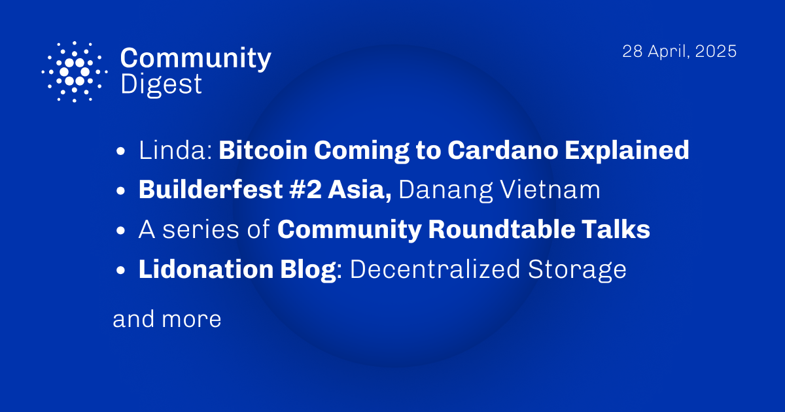

The April 28, 2025, Cardano Community Digest highlights an explanation of how Bitcoin can interact with Cardano using zero-knowledge cryptography without custodians. It recaps BuilderFest #2 in Vietnam and covers recent Roundtable Talks discussing Interim Constitutional Committee learnings, development priorities, and stablecoin liquidity. Updates include LidoNation's blog on decentralized storage, EMURGO's guidance on budget voting, and Intersect's news on governance developments and upcoming committee elections.

 [**Read more**](https://forum.cardano.org/t/digest-april-28-2025-bitcoin-coming-to-cardano-explained-builderfest-2-asia-danang-vietnam-a-series-of-community-roundtable-talks-lidonation-blog-decentralized-storage/145573) 

 

