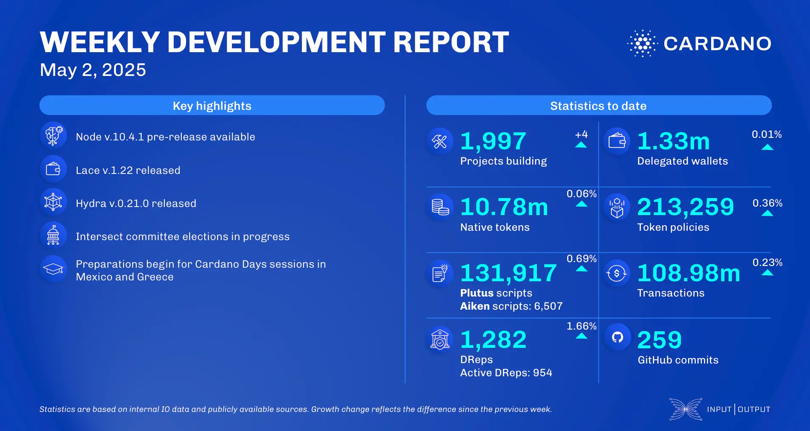

The May 02, 2025, development report highlights the pre-release of Node v.10.4.1 with a production-ready UTXO-HD backend and consensus team advancements in testing models. Lace wallet v.1.22 launched, introducing Firefox browser support and Bitcoin integration (beta). Smart contract updates included strictness analysis for UPLC and PIR. The ecosystem saw continued growth in projects and DRep participation, with TapTools launching the Cardano Builder DAO and Metera mainnet going live.

 [**Read more**](https://www.essentialcardano.io/development-update/weekly-development-report-as-of-2025-05-02) 

 

