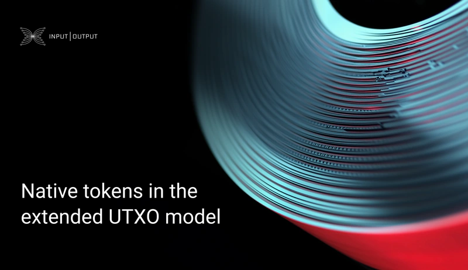

Input Output Global (IOG) published a blog post on May 09, 2025, detailing native tokens within Cardano's Extended UTXO (EUTXO) model. The post explains how these tokens function without requiring smart contracts for creation or transfer, unlike account-based systems like Ethereum. This design offers enhanced security and reduced transaction fees for users. The article contrasts Cardano's approach with traditional ERC-20 tokens, emphasizing the inherent advantages of its native token implementation.

 [**Read more**](https://iohk.io/en/blog/posts/2025/05/09/native-tokens-in-the-extended-utxo-model/) 

 

