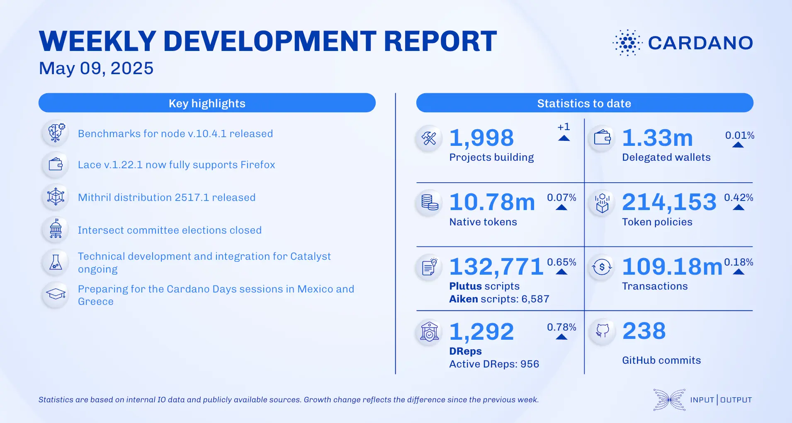

The May 09, 2025, development report information, largely reflected in Intersect's update, highlights significant progress in governance processes. This includes the upcoming submission of a budget info action with 39 proposals for DRep voting in epoch 557, and the opening of candidate registration for the Constitutional Committee, running until May 31st. The report also noted a strong voter turnout for Q1 committee elections and an increase in DRep statistics. Additionally, community contributions such as the Lucid Evolution off-chain framework and the Midgard Protocol L2 solution were mentioned.

 [**Read more**](https://www.essentialcardano.io/development-update/weekly-development-report-as-of-2025-05-09) 

 

