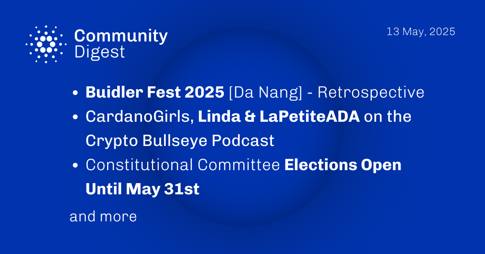

The May 13, 2025, Cardano Community Digest highlights a retrospective video from Builder Fest #2 in Da Nang. It features CardanoGirls (Linda & LaPetiteADA) on the Crypto Bullseye Podcast discussing governance and scaling, and reminds that Constitutional Committee elections are open until May 31st. Also included are Yuta's summary of the Technical Steering Committee meeting, a new stake pool dynamics visualization tool, and Peter Bui’s multisig tutorial.

 [**Read more**](https://forum.cardano.org/t/digest-may-13-2025-buidler-fest-2025-da-nang-retrospective-cardanogirls-linda-lapetiteada-on-the-crypto-bullseye-podcast-constitutional-committee-elections-open-until-may-31st/145919) 

 

