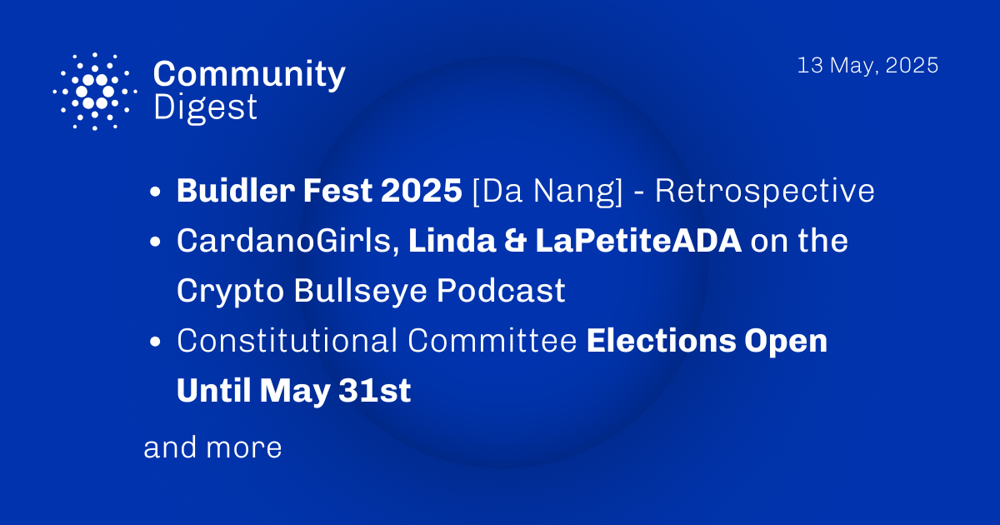

A retrospective video from Builder Fest #2 in Da Nang was highlighted, showcasing ecosystem collaboration. Discussions on governance and scaling were featured on the Crypto Bullseye Podcast, with a reminder that Constitutional Committee elections are open until May 31st. Updates include a summary of the Technical Steering Committee meeting, a new stake pool dynamics visualization tool, and a tutorial on multisig transactions.

 [**Read more**](https://forum.cardano.org/t/digest-may-13-2025-buidler-fest-2025-da-nang-retrospective-cardanogirls-linda-lapetiteada-on-the-crypto-bullseye-podcast-constitutional-committee-elections-open-until-may-31st/145919) 

 

