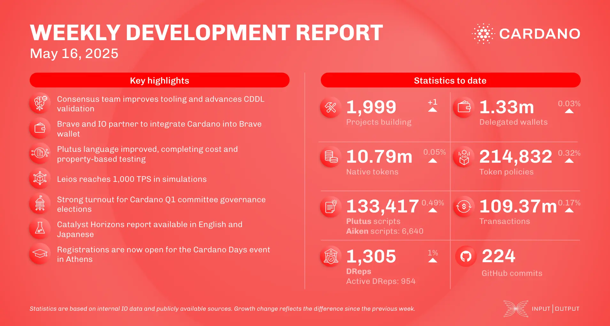

The May 16, 2025, development report highlights consensus team fixes for Genesis and progress on Cardano Blueprint CDDL validation. Brave and IO are partnering to integrate Cardano into the Brave wallet. Plutus team advanced formal methods and modular-exponentiation testing. Scaling work included Leios simulations reaching 1,000 TPS and Mithril DMQ node advancements. The Cardano budget proposal was submitted on-chain as an info action, and FluidTokens launched Babel fees.

 [**Read more**](https://www.essentialcardano.io/development-update/weekly-development-report-as-of-2025-05-16) 

 

