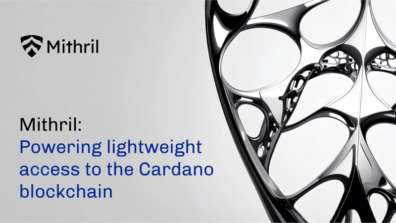

In a blog post dated May 19, 2025, Input Output Global (IOG) explains how its Mithril protocol provides lightweight access to the Cardano blockchain. Mithril allows users and applications to verify the state of the chain quickly and securely without downloading its entire history. This is achieved through a stake-based multi-signature scheme where a quorum of stakeholders certifies snapshots of the blockchain. This significantly lowers resource usage, making it ideal for light wallets, mobile applications, and layer 2 solutions.

 [**Read more**](https://iohk.io/en/blog/posts/2025/05/19/mithril-powering-lightweight-access-to-the-cardano-blockchain/) 

 

