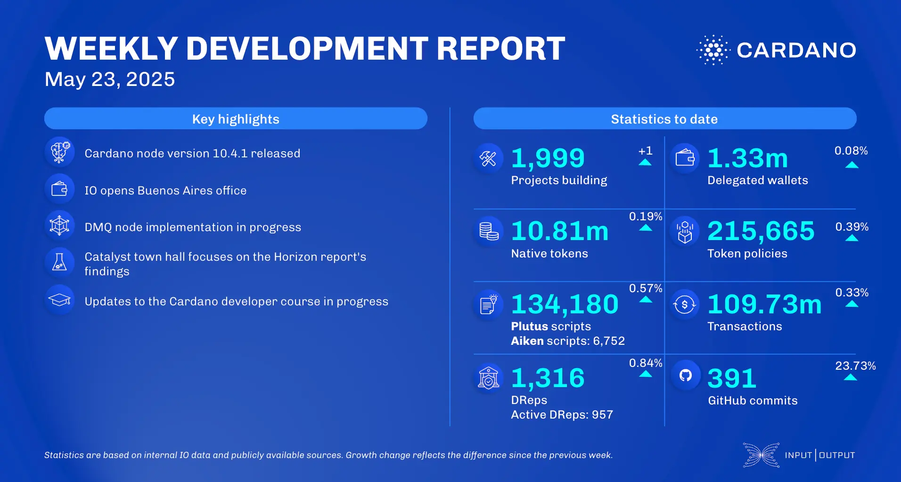

The May 23, 2025, development report highlights the release of Cardano node v.10.4.1, introducing the UTXO-HD feature for flexible UTXO set storage. Ecosystem updates include Flow DeFi releasing its litepaper and integrating with Strike Finance, Trust Wallet enabling in-app DRep delegation, Emurgo announcing it will no longer use genesis ada for governance, and a new Liqwid Labs integration with Begin Wallet. Growth continued in projects, transactions, and smart contract deployment.

 [**Read more**](https://www.essentialcardano.io/development-update/weekly-development-report-as-of-2025-05-23) 

 

