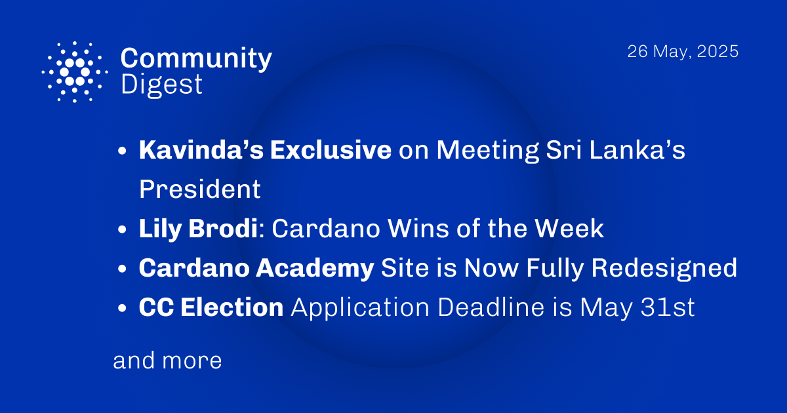

The May 26, 2025, Cardano Community Digest highlights an exclusive from Kavinda detailing his meeting with Sri Lanka's President. It also features Lily Brodi’s "Cardano Wins of the Week," showcases the newly redesigned Cardano Academy website, and reminds community members that the application deadline for the Constitutional Committee elections is May 31st. The digest covers these key community updates and engagements.

 [**Read more**](https://forum.cardano.org/t/digest-may-26-2025-kavindas-exclusive-on-meeting-sri-lankas-president-lily-brodi-cardano-wins-of-the-week-cardano-academy-site-is-now-fully-redesigned-cc-election-application-deadline-is-may-31st/146307) 

 

