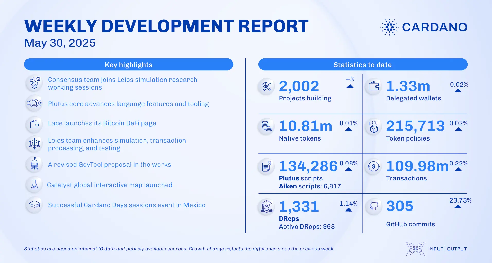

The May 30, 2025, development report highlights the bridging of Bitcoin Ordinals to Cardano via BitVMX and a new partnership between the Cardano Foundation and UNHCR for a crypto-backed ETP supporting refugees. Core technology work focused on performance benchmarks and preparing for the LSM-tree storage layer. The consensus team onboarded to the Leios simulator and patched several CDDL specifications. Smart contract work included enhancing CEK-machine diagnostics and expanding documentation.

 [**Read more**](https://www.essentialcardano.io/development-update/weekly-development-report-as-of-2025-05-30) 

 

