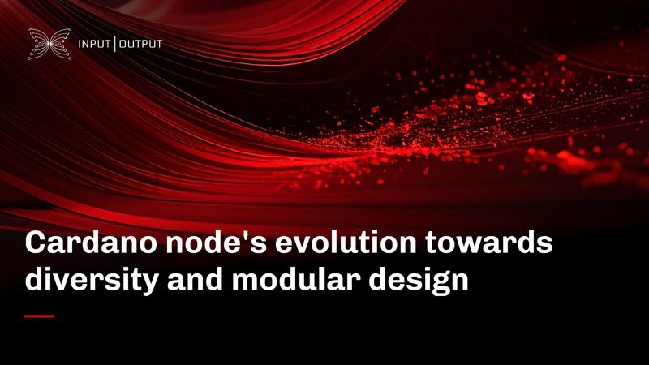

A blog post by Input Output Global (IOG) from June 06, 2025, details the evolution of the Cardano node from a monolithic application into a modular framework. This transformation breaks the node into smaller, independent components for aspects like consensus, ledger, and networking. The post explains that this modular design enhances flexibility for developers, simplifies updates, and critically, fosters client diversity. By enabling the creation of alternative node clients, this evolution aims to improve the overall resilience of the Cardano network.

 [**Read more**](https://iohk.io/en/blog/posts/2025/06/06/cardano-nodes-evolution-towards-diversity-and-modular-design/) 

 

