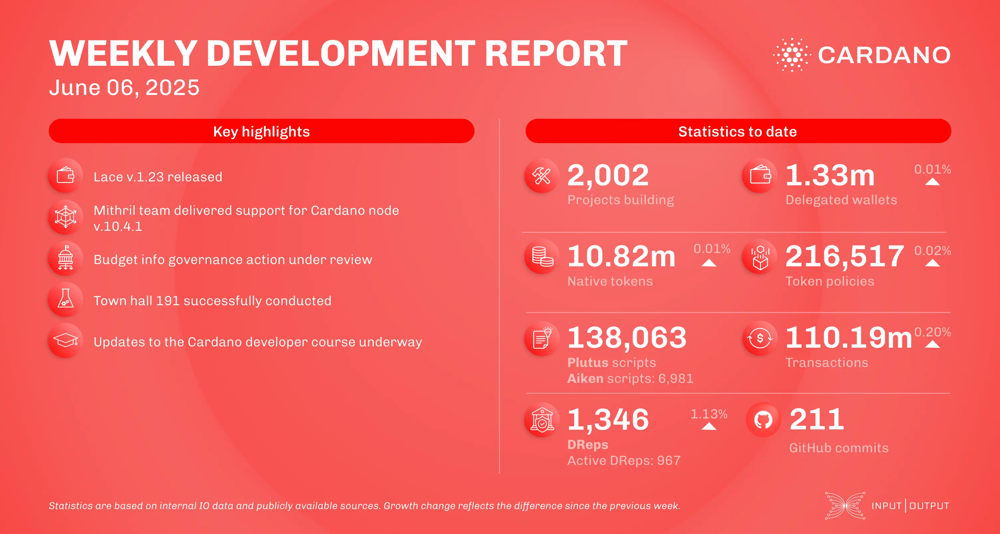

The June 06, 2025, development report highlights the release of Lace wallet v.1.23, which features a more accurate pricing feed for Cardano native tokens in response to community feedback. On the scaling front, the Mithril team delivered support for node v.10.4.1 and UTXO-HD in their tools and advanced the development of the DMQ node. The Leios team finalized an analysis of overcollateralization models and progressed on their Rust-based simulation framework for evaluating transaction duplication and conflict likelihood.

 [**Read more**](https://www.essentialcardano.io/development-update/weekly-development-report-as-of-2025-06-06) 

 

