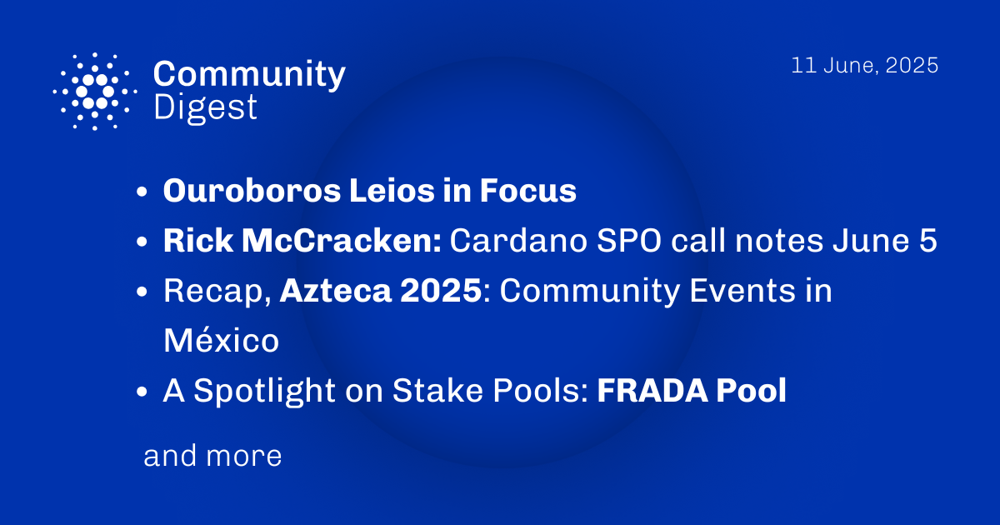

The June 11, 2025, Cardano Community Digest highlights a focus on the Ouroboros Leios consensus protocol, explaining its significance for the network's future. It also provides a recap of the June 5th Stake Pool Operator call through notes from Rick McCracken. Additionally, the digest covers the recent Azteca 2025 community events in Mexico and features a spotlight on the FRADA stake pool, showcasing different aspects of the ecosystem.

 [**Read more**](https://forum.cardano.org/t/digest-june-11-2025-ouroboros-leios-in-focus-rick-mccracken-cardano-spo-call-notes-june-5-recap-azteca-2025-community-events-in-mexico-a-spotlight-on-stake-pools-frada-pool/146693) 

 

