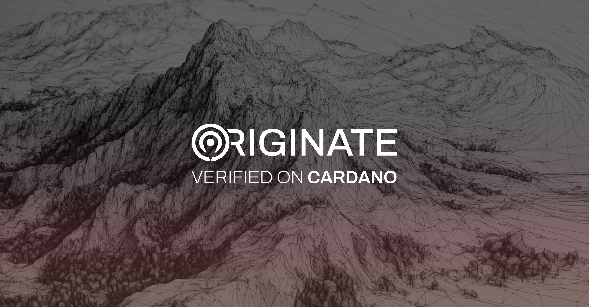

The Cardano Foundation has launched Originate, an open-source traceability solution built on the Cardano blockchain. It enables businesses to verify product authenticity and support certifications, enhancing supply chain transparency and combating counterfeiting. A successful case study in the Georgian wine industry demonstrated its effectiveness in fighting counterfeit products. Originate provides a secure, scalable, and cost-effective way for industries like luxury goods and pharmaceuticals to increase consumer trust. The code is available on GitHub for community contribution.

 [**Read more**](https://cardanofoundation.org/blog/introducing-originate) 

 

