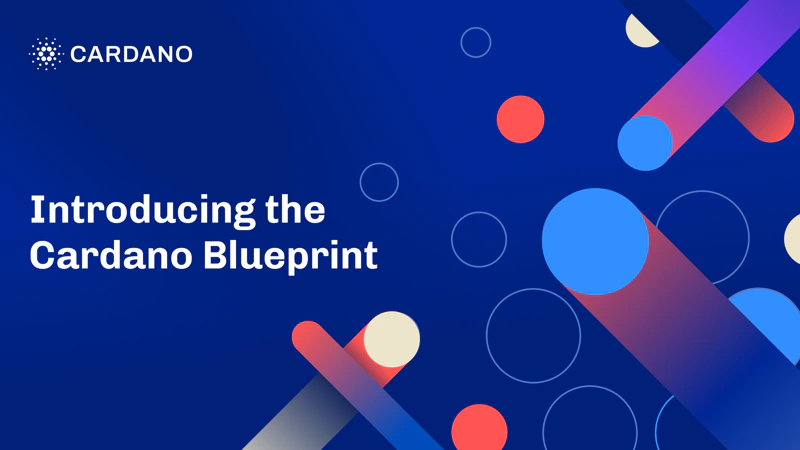

On June 20, 2025, Input Output Global (IOG) introduced the Cardano Blueprint, a comprehensive, open-source reference guide to the platform. This living document is designed to be a single source of truth, detailing Cardano's core components, architecture, protocols, and design principles. The Blueprint aims to enhance transparency and accessibility for developers, researchers, and the wider community. By providing a standardized technical reference, it seeks to improve the onboarding process and foster a deeper understanding of Cardano's intricacies.

 [**Read more**](https://iohk.io/en/blog/posts/2025/06/20/understanding-cardano-introducing-the-cardano-blueprint/) 

 

