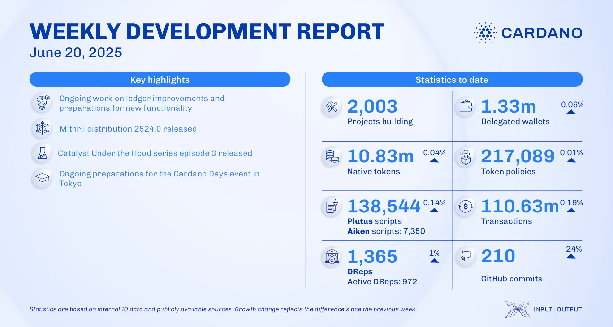

The June 20, 2025, development report highlights significant work by the ledger team to modernize the codebase and prepare for an upcoming intra-era hard fork. This included enhancing CDDL specifications, reducing technical debt, and conducting preliminary work on nested transactions. The report also touched upon future node improvements like log-structured merge (LSM) trees and revised stake pool incentives. Governance participation continued to grow, with an increase in the number of registered DReps.

 [**Read more**](https://www.essentialcardano.io/development-update/weekly-development-report-as-of-2025-06-20) 

 

