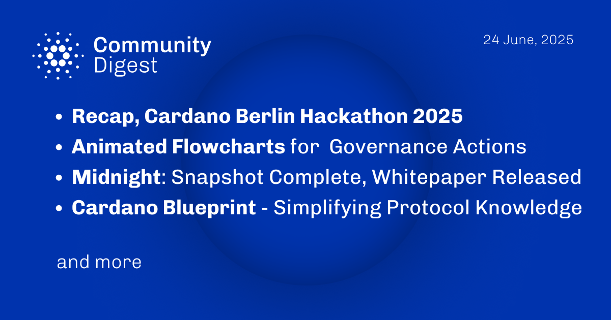

The June 24, 2025, Cardano Community Digest recaps the Cardano Berlin Hackathon and the Eureka Crypto Conference, both community-driven events from Berlin Blockchain Week. It highlights Midnight's new Tokenomics & Incentives paper and the release of animated governance flowcharts on cardano.org. Additionally, the digest features the latest from Essential Cardano's Dev Report and an introduction to the Cardano Blueprint, a resource designed to simplify understanding of the protocol.

 [**Read more**](https://forum.cardano.org/t/digest-june-24-2025-recap-cardano-berlin-hackathon-2025-animated-flowcharts-for-governance-actions-midnight-snapshot-complete-whitepaper-released-cardano-blueprint-simplifying-protocol/146986) 

 

