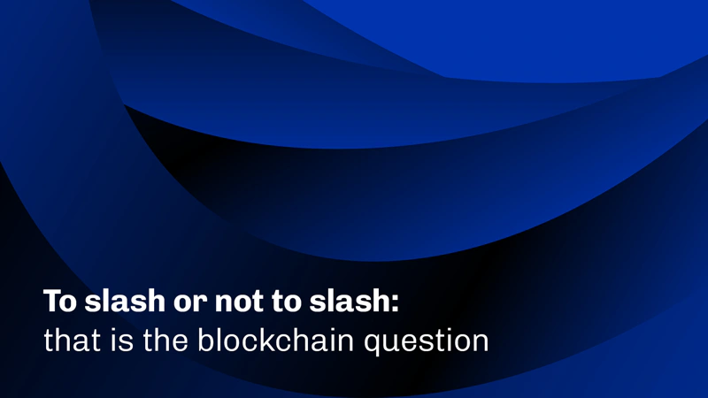

A June 23, 2025, IOHK blog post by a team of researchers explores the concept of slashing as a security mechanism in blockchains. It contrasts Ethereum's slashing-based model, where validators risk losing staked assets for misbehavior, with Cardano's non-slashing approach. The authors argue that slashing is ineffective against majority attacks and can deter participation, while Cardano’s method, relying on formal verification and stake-weighted incentives, provides robust security without these drawbacks.

 [**Read more**](https://iohk.io/en/blog/posts/2025/06/24/to-slash-or-not-to-slash-that-is-the-blockchain-question/) 

 

