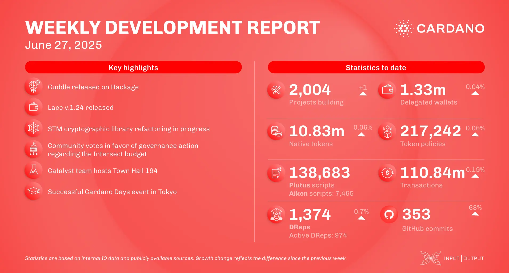

The June 27, 2025, development report highlights continued ecosystem growth, with the number of projects building on Cardano reaching 2,004. The consensus team enhanced the Leios simulator and improved resource management in UTXO-HD. The Lace team released v.1.24 with multichain and user-centric upgrades. Mithril focused on the DMQ network, while Hydra released v.0.22.0. The community also voted in favor of the Intersect budget info action, paving the way for treasury withdrawals.

 [**Read more**](https://www.essentialcardano.io/development-update/weekly-development-report-as-of-2025-06-27) 

 

