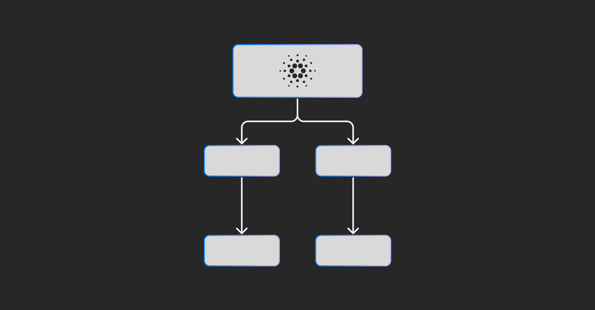

On July 4, 2025, the Cardano Foundation, through Governance Lead Nicolas Cerny, released a set of 14 flowcharts to clarify Cardano's governance actions. These visual guides aim to make the on-chain voting processes more understandable and transparent for the community. By demystifying the procedures for different governance actions, the Foundation hopes to encourage broader and more informed participation. The release underscores the evolving nature of Cardano's governance and the importance of an engaged community in shaping the protocol's future.

 [**Read more**](https://cardanofoundation.org/blog/understanding-cardano-governance-actions) 

 

