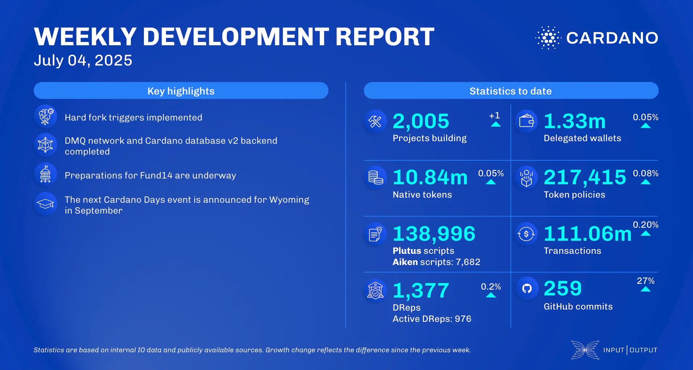

The July 04, 2025, development report highlights continued ecosystem growth, with 2,005 active projects now building on Cardano. The ledger team defined PlutusV4 for the Dijkstra era, fixed a serialization bug, and implemented hard fork triggers. Scaling work saw the Mithril team complete the implementation of the publisher and consumer for the DMQ network, while the Hydra team worked on their 2025-2026 roadmap and Glacier-drop support. Ecosystem news includes MuesliSwap’s launch of MidStarterApp and Flow DeFi confirming USDA stablecoin support.

 [**Read more**](https://www.essentialcardano.io/development-update/weekly-development-report-as-of-2025-07-04) 

 

