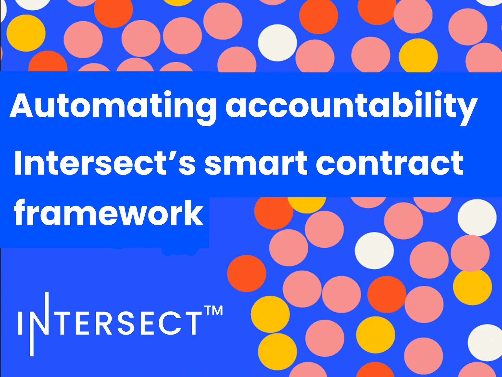

Intersect has introduced a smart contract framework to securely manage Cardano's growing treasury. Published on July 8, the framework brings treasury operations on-chain for transparency and auditability. It uses two contract types: Treasury Contracts to hold reserves and Vendor Contracts for project-specific payments. A multi-signature permissions model requires Intersect, as Administrator, to initiate actions, while an independent Oversight Committee provides verification. This system ensures no single entity has unilateral control, enhancing accountability and trust in the distribution of community-approved funds.

 [**Read more**](https://www.intersectmbo.org/news/automating-accountability-cardanos-smart-contract-framework) 

 

