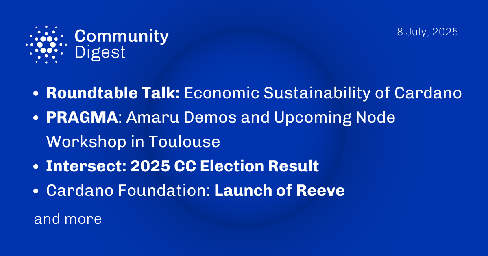

The July 8, 2025, Cardano Community Digest features a Roundtable Talk on the economic sustainability of Cardano, along with demos from Pragma and Amaru. It also includes information about an upcoming node workshop in Toulouse. Additionally, the digest announces the results of the Intersect 2025 Constitutional Committee election and highlights the Cardano Foundation's launch of Reeve, a new on-chain financial reporting solution.

 [**Read more**](https://forum.cardano.org/t/digest-july-8-2025-roundtable-talk-economic-sustainability-of-cardano-pragma-amaru-demos-and-upcoming-node-workshop-in-toulouse-intersect-2025-cc-election-result-cardano-foundation-launch-of-reeve-a-new-on-chain-financial-reporting-solution/147295) 

 

