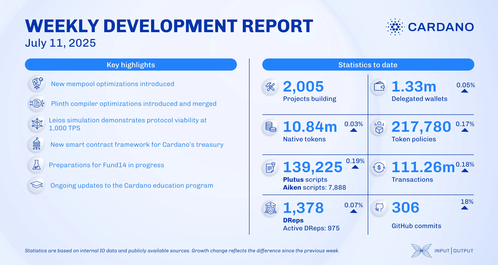

The July 11, 2025, development report highlights continued ecosystem growth, with 2,005 projects now building on Cardano. The consensus team introduced mempool optimizations and added node-to-node CDDL specifications. The Plutus Core team merged support for case analysis on booleans and integers, while the Plinth team introduced a new compiler optimization. Other notable updates include the Cardano Foundation launching Reeve, Intersect partnering with SundaeSwap, and Vespr Wallet open-sourcing its SDKs.

 [**Read more**](https://www.essentialcardano.io/development-update/weekly-development-report-as-of-2025-07-11) 

 

